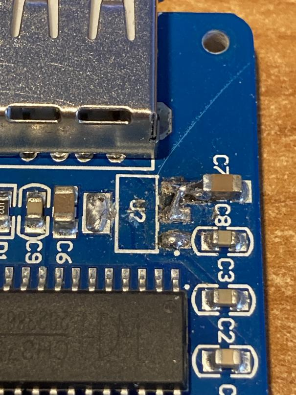
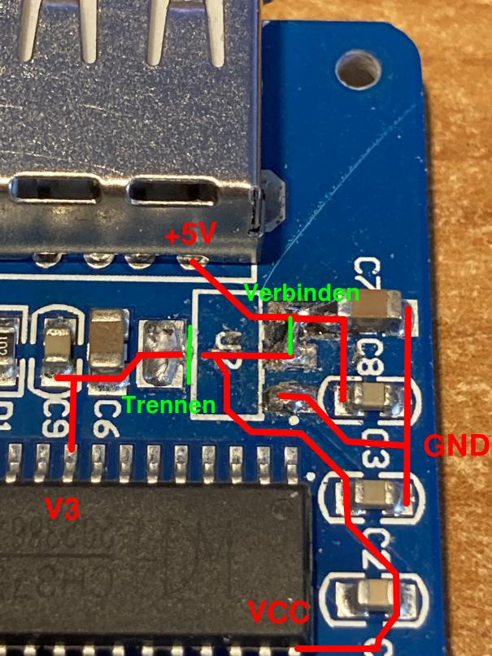

# Treiber
### AFICH375
Treiber für das Ardunino CH375 USB-Modul
+ Getestet unter DCP3.3 und MS-Dos 6.22
+ Belegt ca. 1,5 KB Arbeitsspeicher im Hauptsystem
+ Benötigt Firmware-Support (IDE_CHS ab Version 0.3)
+ Installation: afich375.sys auf den Start-Datenträger kopieren. Eintrag in die config.sys ohne weitere Parameter: `device=afich375.sys`

ACHTUNG! FÜr den Betrieb des Arduino-Moduls an 5V TTL muss die CH375-Platine von 3,3V auf 5V Signalpegel umgebaut werden.

Der Chip hat 2 Spannungsversorgungen:

3,3V auf Pin V3

3,3V oder 5V auf Pin VCC

Die Spannung an V3 nutzt der Chip für sich selbst, die Spannung an VCC für die Versorgung der E/A-Pins. Der Chip hat intern einen Spannungsregler zwischen VCC und V3, so dass der Chip sich selber mit 3,3V versorgen kann, wenn an VCC 5V anliegen.
